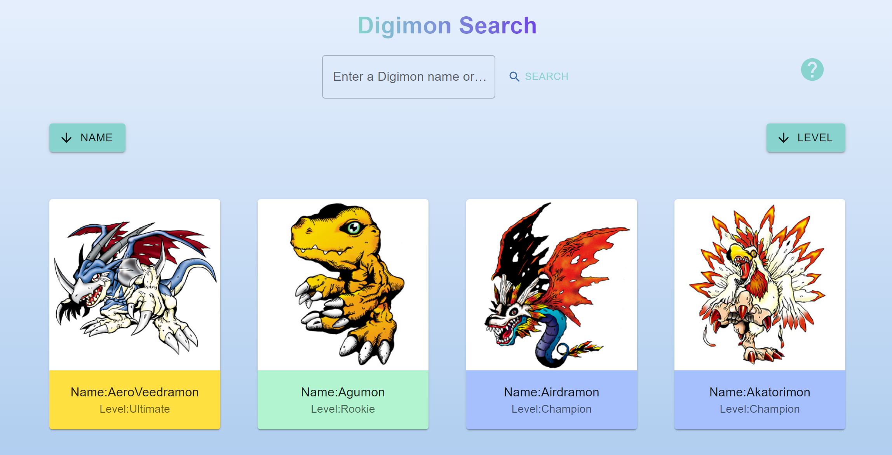

# Digimon Search 2.0

This is a React Typescript project with a REST API that allows you to search for digimon. You can search for a digimon by name,or level. What's more, you also can sort them by their name or level. You can see some names and levels example by clicking the help button in the project, You can use them to test the project and see the effect. This have made a upgrade based on the first version.



## How to run

You can view this project by clicking [here](). or you can download the project ,direct to the folder and run by below commands

```
1. npm install
2. npm start
```

## The skill or Technology used

- UI Scalability with window size
- Mobile first development (using media query breakpoints, etc)
- Storybook w/ both actions and interactions (play)
- Progressive Web App (PWA) functionality w/ clear use of the service worker
- At least one fluid animation
- Redux state management